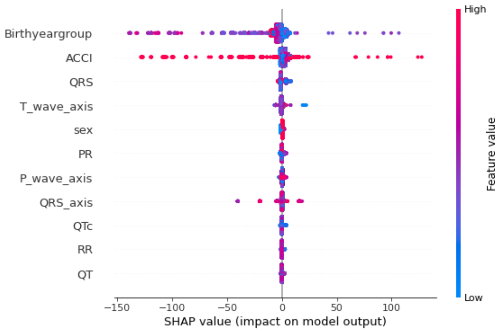
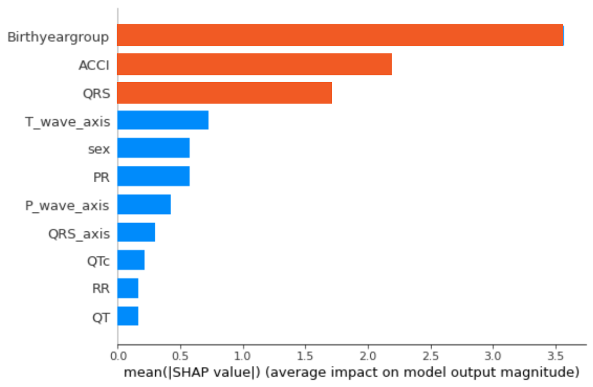

# Explainable Prediction of Acute Myocardial Infarction using Machine Learning and Shapley Values

This repository is the official implementation of [Explainable Prediction of Acute Myocardial Infarction using Machine Learning and Shapley Values](). 


## Requirements

* To install Python 3, follow these [instructions](https://realpython.com/installing-python/). 
* To install Pip, follow these [instructions](https://pip.pypa.io/en/stable/installing/).
* To install Jupyter Lab/Notebook, follow these [instructions](https://jupyterlab.readthedocs.io/en/stable/getting_started/installation.html). To run Jupyter Lab/Notebook, follow these [instructions](https://jupyter.readthedocs.io/en/latest/running.html). 
* To set up a virtual environment, follow these [instructions](https://uoa-eresearch.github.io/eresearch-cookbook/recipe/2014/11/26/python-virtual-env/).

* To install requirements:

```setup
pip3 install -r requirements.txt
```

* To obtain the ECG ViEW II dataset, please use this [form](http://ecgview.org/ECG_ViEW.asp). After recieving the unprocessed files, follow the [data processing](https://github.com/lujainibrahim/ecg-view-machine-learning#data-processing) steps below. 


## Data Processing

To process the ECG-ViEW II dataset as it is done in the paper (with robust scaling and SMOTE), run this [notebook](https://github.com/lujainibrahim/ecg-view-machine-learning/blob/master/data%20processing/data_processing.ipynb).

This notebook will produce two csv files, test.csv and train.csv, that you can then train/evaluate models with. If you would like to use the train and test files we used to obtain/reproduce our results, those can be found [here](https://drive.google.com/drive/folders/1-WcMjYm-jhuvE1vDpW76HkYW-xrOuPQ6?usp=sharing).

## Training

* To train the CNN model in the paper, run this [notebook](https://github.com/lujainibrahim/ecg-view-machine-learning/blob/master/CNN/CNN_train.ipynb).
* To train the RNN model in the paper, run this [notebook](https://github.com/lujainibrahim/ecg-view-machine-learning/blob/master/RNN/RNN_train.ipynb).
* To train the XGBoost model in the paper, run this [notebook](https://github.com/lujainibrahim/ecg-view-machine-learning/blob/master/XGBoost/XGBoost_train.ipynb).

These notebooks will train the model and save it in a file that can be imported for evaluation later (described in the next section). 

## Evaluation

* To evaluate the CNN on the processed ECG-ViEW II data, run this [notebook](https://github.com/lujainibrahim/ecg-view-machine-learning/blob/master/CNN/CNN_evaluate.ipynb).
* To evaluate the RNN on the processed ECG-ViEW II data, run this [notebook](https://github.com/lujainibrahim/ecg-view-machine-learning/blob/master/RNN/RNN_evaluate.ipynb).
* To evaluate the XGBoost on the processed ECG-ViEW II data, run this [notebook](https://github.com/lujainibrahim/ecg-view-machine-learning/blob/master/XGBoost/XGBoost_evaluate.ipynb).

To reproduce the results in the paper, use the [pretrained models](https://github.com/lujainibrahim/ecg-view-machine-learning#pre-trained-models) and this [data](https://drive.google.com/drive/folders/1-WcMjYm-jhuvE1vDpW76HkYW-xrOuPQ6?usp=sharing). Additionally, to train and evaluate models without the age and sex features, please see these folders ([CNN](https://github.com/lujainibrahim/ecg-view-machine-learning/tree/master/CNN/no%20agesex), [RNN](https://github.com/lujainibrahim/ecg-view-machine-learning/blob/master/RNN/no%20agesex/rnn_ecgview_noagesex_pretrained.h5))

## Pre-trained Models

You can download pretrained models here:
With age and sex: 
- [CNN](https://github.com/lujainibrahim/ecg-view-machine-learning/blob/master/CNN/cnn_ecgview_pretrained.h5) trained on ECG-ViEW II
- [RNN](https://github.com/lujainibrahim/ecg-view-machine-learning/blob/master/RNN/rnn_ecgview_pretrained.h5) trained on ECG-ViEW II
- [XGBoost]() trained on ECG-ViEW II

Witout age and sex: 
- [CNN](https://github.com/lujainibrahim/ecg-view-machine-learning/blob/master/CNN/no%20agesex/cnn_ecgview_noagesex_pretrained.h5) trained on ECG-ViEW II
- [RNN](https://github.com/lujainibrahim/ecg-view-machine-learning/blob/master/RNN/no%20agesex/rnn_ecgview_noagesex_pretrained.h5) trained on ECG-ViEW II
- [XGBoost](https://github.com/lujainibrahim/ecg-view-machine-learning/blob/master/XGBoost/XGBoost_pretrained.model) trained on ECG-ViEW II

## Results

Our models achieve the following performances:

### [AMI Prediction Using Processed ECG-ViEW II](https://drive.google.com/drive/folders/1-WcMjYm-jhuvE1vDpW76HkYW-xrOuPQ6?usp=sharing)

| Model      | Accuracy  | F1 Score | AUROC | Sensitivity | Specificity |
| ------------------ |---------------- | -------------- | -------------- | -------------- | -------------- |
|CNN   |    89.9 %         |     89.0 %       |90.7 %|88.1 %|93.2%|
|RNN   |    84.6 %         |     82.2 %       |82.9 %|78.0 %|87.8 %|
|XGBoost   |    97.5 %         |     97.1 %       |96.5 %|93.5 %|99.4 %|


### Shapley Analysis 

Shapley analysis on the XGBoost model shows that age, ACCI, and QRS duration are the most crucial variables in the prediction of the onset of AMI, while sex is of relatively less importance. The Shapley analysis is shown to be a promising technique to uncover the intricacies and mechanisms of the prediction model, leading to higher degree of interpretation and transparency.

The local explanation summary (beeswarm) plot gives an overview of the impact of features on the prediction, with each dot representing the Shapley value of every feature for all samples.
<p align="center">

</p>

The global feature importance plot shows the average absolute of the Shapley values over the whole testing dataset. Age (Birthyeargroup), ACCI, and QRS duration were observed to be the most important features for the prediction. 
<p align="center">

</p>

## Contributing

> 📋Pick a licence and describe how to contribute to your code repository. 
